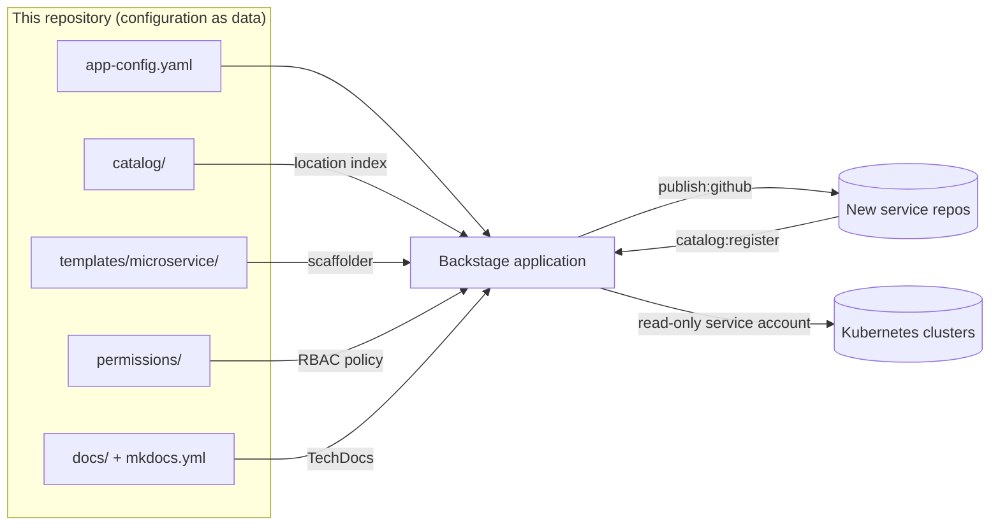

# Internal Developer Platform

An internal developer platform built on [Backstage](https://backstage.io). It
gives product teams one place to discover services, scaffold new ones from
golden-path templates, and read living documentation — with ownership and access
control wired in from the start.

## Capabilities

- **Software catalog** — a single source of truth for services, APIs, resources,
  and the teams that own them.
- **Software templates** — golden-path scaffolding that creates a new service
  with CI, ownership, and documentation already in place.
- **TechDocs** — documentation that lives next to the code and is published
  alongside each catalog entity.
- **Kubernetes & ownership views** — workload health and ownership surfaced
  directly against catalog entities.
- **Permission policy** — role-based access control over catalog and scaffolder
  actions.

## Architecture at a glance



The repository is deliberately **configuration, not application code**: a
standard Backstage app consumes it, which keeps platform upgrades independent
from catalog and policy changes. See
[docs/architecture.md](docs/architecture.md) for the full walkthrough.

## Repository layout

| Path | Purpose |
| --- | --- |
| `app-config.yaml` | Core platform configuration: backend, integrations, catalog, auth, TechDocs, Kubernetes, permissions. |
| `catalog/all.yaml` | Catalog location index plus the core domain and system. |
| `catalog/org.yaml` | Organizational model — groups and users. |
| `catalog/components.yaml` | Platform-owned components (e.g. the portal itself). |
| `templates/microservice/` | Golden-path software template and its service skeleton. |
| `permissions/` | RBAC policy CSV and conditional (owner-scoped) policies. |
| `docs/` + `mkdocs.yml` | The platform's own TechDocs site. |
| `tests/` | Validation harness for entities, templates, and policies. |
| `Makefile` | Entry points: `validate`, `lint`, `serve`, and friends. |

## Getting started

1. Create or check out a Backstage app (`npx @backstage/create-app`).
2. Point the app at this repository's `app-config.yaml`.
3. Export the environment variables listed below.
4. The catalog loads `catalog/all.yaml`, which registers the organizational
   model, the platform domain and system, the portal component, and the
   golden-path template.

New to the platform as a team or service owner? Follow the
[onboarding guide](docs/onboarding.md) — it covers joining the organizational
model, scaffolding your first service, registering existing services, and
wiring up Kubernetes and documentation views.

## Configuration

All secrets and environment-specific endpoints are supplied through environment
variables — nothing sensitive is committed. Among others, the platform reads:

| Variable | Description |
| --- | --- |
| `APP_BASE_URL` | Public URL of the frontend app. |
| `BACKEND_BASE_URL` | Public URL of the backend. |
| `POSTGRES_HOST`, `POSTGRES_PORT` | Catalog database endpoint. |
| `POSTGRES_USER`, `POSTGRES_PASSWORD` | Catalog database credentials. |
| `GITHUB_TOKEN` | Token used to ingest catalog entities and run templates. |
| `AUTH_GITHUB_CLIENT_ID`, `AUTH_GITHUB_CLIENT_SECRET` | OAuth credentials for sign-in. |
| `K8S_CLUSTER_URL`, `K8S_SA_TOKEN`, `K8S_CA_DATA` | Read-only cluster access for workload views. |

Provide them via a git-ignored `.env` file or your secret manager of choice.

## Catalog model

Ownership flows from the organizational model in `catalog/org.yaml`:

- `engineering` (department)
  - `platform-engineering` — owns the platform and golden paths
  - `application-development` — builds product services
  - `site-reliability` — owns availability and incident response

The platform itself is modelled as the `developer-platform` **System** inside
the `platform` **Domain**, with the portal as a **Component** carrying
Kubernetes annotations. Every entity resolves to an owning group, and the
single `catalog/all.yaml` Location is the only entry point the app trusts —
adding an entity means adding it to the index, which keeps ingestion auditable.

| Kind | Where | Notes |
| --- | --- | --- |
| Domain / System | `catalog/all.yaml` | Platform boundary and its core system. |
| Group / User | `catalog/org.yaml` | Department → teams → members, with `memberOf` links. |
| Component | `catalog/components.yaml` | Carries `backstage.io/kubernetes-id` for workload views. |
| Template | `templates/microservice/template.yaml` | Golden-path service scaffolding. |
| Location | `catalog/all.yaml` | Single index; the only rule-allowed entry point. |

## Validation

Every change is checked before it reaches the live catalog:

```bash
make install    # once: install the validation harness
make validate   # type-check + full entity/template/policy test suite
make lint       # yamllint over the YAML sources
```

The suite cross-references the whole repository — entity schemas and name
rules, org-model symmetry, ownership references, location-index completeness,
template parameter/step integrity, RBAC policy arity and role mappings, and
configuration hygiene (secrets only ever arrive via `${ENV}` substitution).

## Documentation

The platform documents itself with TechDocs. Start at
[docs/index.md](docs/index.md), or jump to:

| Page | Contents |
| --- | --- |
| [Architecture](docs/architecture.md) | Component walkthrough, golden-path flow, access control. |
| [Onboarding](docs/onboarding.md) | Joining the org model, first service, Kubernetes + docs wiring. |
| [Software catalog](docs/software-catalog.md) | Entity model, ownership, location index. |
| [Software templates](docs/software-templates.md) | Golden-path microservice template reference. |
| [Authoring documentation](docs/authoring-docs.md) | Docs-like-code guide for service teams. |

Preview locally with `make serve`.

## Contributing

Contributions are welcome. Open a Discussion in the repository or comment on a
pull request to propose changes.

## License

Released under the MIT License. See [LICENSE](LICENSE).
