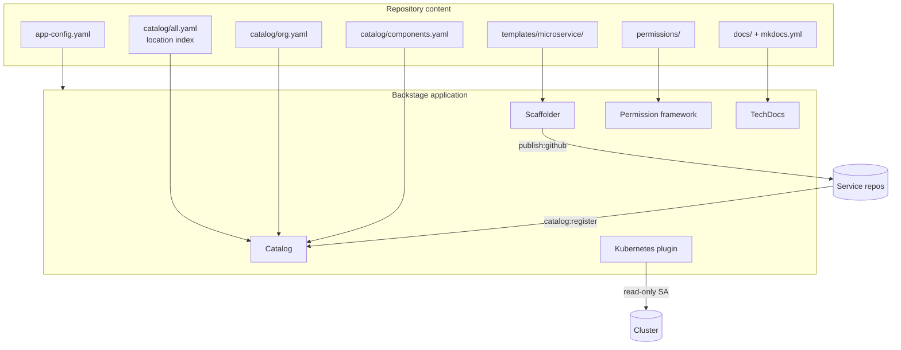
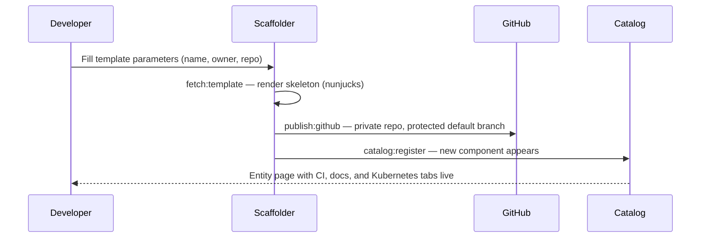

# Platform architecture

This page walks through how the pieces of the platform fit together and the
design decisions behind them.

## Configuration as data

The repository contains no Backstage application code. It is the
**configuration and content** a standard Backstage app consumes:

Separating configuration from application code means platform upgrades
(bumping the Backstage app) and content changes (catalog entities, templates,
policies) ship independently, each with its own review and validation path.

## Configuration surface

`app-config.yaml` is the single configuration entry point. Three rules keep it
safe to publish:

1. **Secrets only via substitution.** Database credentials, the GitHub token,
   OAuth client secrets, and the Kubernetes service-account token all arrive
   as `${ENV_VAR}` references. The validation suite fails if any of them ever
   appears as a literal.
2. **TLS everywhere.** The catalog database requires TLS and the Kubernetes
   cluster locator sets `skipTLSVerify: false`; both are asserted by tests.
3. **Explicit catalog rules.** Only the entity kinds the platform actually
   uses are allowed, and `catalog/all.yaml` is the only Location the app
   loads, so every entity's provenance is reviewable in one place.

## Catalog composition

The catalog follows a **single location index** pattern. `catalog/all.yaml`
is a `Location` entity whose targets enumerate every other entity file — the
organizational model, platform components, and the software template. Adding
an entity is therefore always a two-line change: the entity file and its index
entry, both validated in CI.

Ownership is modelled top-down: an `engineering` department contains the
`platform-engineering`, `application-development`, and `site-reliability`
teams, and users join via `memberOf`. Every Component, System, and Template
names an owning group, and the test suite fails on any reference that does not
resolve — dangling owners cannot merge.

## Golden-path scaffolding

The `microservice` template is the paved road from idea to running service:

The rendered skeleton is a complete TypeScript HTTP service: pinned CI
workflow, multi-stage non-root Dockerfile, TechDocs site, tests, and a
`catalog-info.yaml` that already carries the `backstage.io/kubernetes-id`
annotation. Teams get ownership, CI, documentation, and workload views on
the first commit rather than as later chores.

## Documentation pipeline

TechDocs builds each entity's `mkdocs.yml` + `docs/` into a static site and
serves it on the entity page. The platform documents itself the same way —
this page is built from the repository's own `docs/` tree (builder `local`,
generator `docker`, publisher `local`, with cloud publishers as the scale-out
path). Scaffolded services inherit an identical setup, so "where are the
docs?" always has the same answer: on the entity.

## Kubernetes integration

The Kubernetes plugin uses the `multiTenant` service locator with a
config-based cluster locator. Credentials are a **read-only service account**
injected through the environment, never committed. Entities opt in via the
`backstage.io/kubernetes-id` annotation (and optionally a namespace
annotation); matching workloads then appear on the entity page. Argo Rollouts
is registered as a custom resource so progressive-delivery objects surface
alongside built-in kinds.

## Access control

Authorization is deny-by-default through the permission framework, with a
casbin-style policy model in `permissions/`:

| Role | Granted to | Capabilities |
| --- | --- | --- |
| `platform-admin` | platform-engineering | Full catalog, scaffolder, Kubernetes, and policy administration. |
| `service-developer` | application-development | Read everything; create entities and locations; execute templates; read Kubernetes resources. |
| `reliability-engineer` | site-reliability | Read everything; use the Kubernetes proxy for operational access. |

Two **conditional policies** narrow mutations further: service developers may
update or delete only entities their team owns (`IS_ENTITY_OWNER`), and
reliability engineers may update only entities that carry a Kubernetes
annotation (`HAS_ANNOTATION`). Policy files are validated for arity, decision
values, and role/group cross-references, and the policy file reloads without
a restart.

## Design decisions

- **Config repo, not a fork.** Tracking upstream Backstage is easiest when the
  app is vanilla and everything bespoke lives here as data.
- **One trusted entry point.** A single indexed Location trades a little
  convenience for complete, reviewable provenance of catalog content.
- **Golden paths over guardrails alone.** The template makes the secure,
  observable, documented option the path of least resistance.
- **Tests as the contract.** The validation harness cross-references entities,
  templates, policies, and configuration so drift fails fast in CI rather
  than at runtime.
